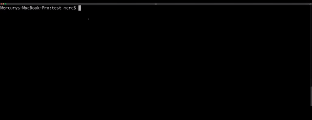

# readme-gen
    
   
 
## Table of Contents
+ [Description](#description)
+ [Installation](#installation)
+ [Usage](#usage)
+ [License](license)
+ [Contributions](#contributions)
+ [Tests](#tests)
+ [Questions](#questions)
## Description
A command line utility that generates a README.md file. It is specifically geared towards users wanting to create READMEs for for github project repositories.
## Installation
Clone or download the files from github. Then run `npm install` to grab the nessecary dependencies from npm, a package.json file is provided.
## Usage
Run `node index.js` to start the program. You will then be asked a series of questions about your project. The resulting information will be used to create a README.md file your current working directory. Can be used to create a README with just the headings by not inputting anything at any of the prompts. 
## License
This project is licensed under the MIT license.
## Contributions
Please contact me with the email below if you would like to contribute.
## Tests
There are not currently any tests for this project.
## Questions
I can be reached at: <mspringberry@gmail.com> with questions about the project.  
My github profile is: [mercspring](https://github.com/mercspring)